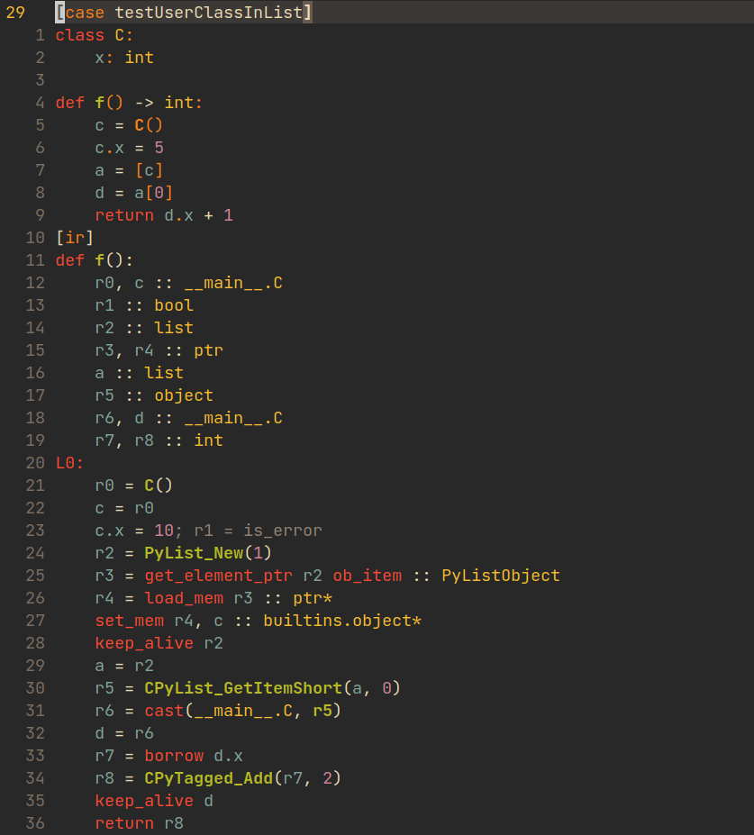

# tree-sitter-mypyc

Mypyc DSL grammar for tree-sitter.



## Installing (Neovim)

This is based on the [Neovim Tree-sitter docs](https://github.com/nvim-treesitter/nvim-treesitter#adding-parsers) for adding new parsers.
Basically you will want to clone this repository and add the following to your `init.lua` Neovim config. It assumes you use Lua
to configure your Neovim config, and that you use [Vim Plug](https://github.com/junegunn/vim-plug) as your package manager. You
might have to change things if your setup is different!

```lua
-- Add the plugin which was cloned locally to your computer. Because this repo actually contains
-- 2 plugins in one, you have to have 2 separate entries.
--
-- Replace "~/git" with the directory you installed this repo to
Plug('~/git/tree-sitter-mypyc', {rtp = 'mypyc_test_cases'})
Plug('~/git/tree-sitter-mypyc', {rtp = 'mypyc_ir'})

-- Create an auto command to change the filetype whenever a ".test" file is opened.
create_autocmd({'BufNewFile', 'BufRead'}, {pattern = '*.test', command = 'set syntax=mypyc_test_cases filetype=mypyc_test_cases'})

-- Optionally you can update/add this section which will guarantee that the mypyc grammar(s) are always installed
require('nvim-treesitter.configs').setup {
  ensure_installed = { 'mypyc_test_cases', 'mypyc_ir' },
  highlight = {
    enable = true
  }
}

-- Add this if you don't have it already
local parser_config = require('nvim-treesitter.parsers').get_parser_configs()

parser_config.mypyc_test_cases = {
  install_info = {
    -- Replace "~/git" with the directory you installed this repo to
    url = "~/git/tree-sitter-mypyc",
    files = {"mypyc_test_cases/src/parser.c"},
    generate_requires_npm = false,
    requires_generate_from_grammar = false,
  },
  filetype = "test",
}
parser_config.mypyc_ir = {
  install_info = {
    -- Replace "~/git" with the directory you installed this repo to
    url = "~/git/tree-sitter-mypyc",
    files = {"mypyc_ir/src/parser.c"},
    generate_requires_npm = false,
    requires_generate_from_grammar = false,
  },
}
```

See my [`init.lua` config file](https://github.com/dosisod/dotfiles/blob/master/.config/nvim/init.lua) for a full example.

Then, you will need to copy the queries that actually style everything. To do this, you must:

1. Find your "runtime path" for Neovim. This is usually in `~/.cache/nvim`. See `:h rtp` for more info.
2. Create the query folders by running: `mkdir -p ~/.cache/nvim/nvim-treesitter/queries/{mypyc_ir,mypyc_test_cases}`
3. Copy the queries to their corresponding files:

```
# while in this repository:

cp mypyc_ir/queries/* ~/.cache/nvim/nvim-treesitter/queries/mypyc_ir
cp mypyc_test_cases/queries/* ~/.cache/nvim/nvim-treesitter/queries/mypyc_test_cases
```

Finally, open `nvim` and execute `:TSInstall mypyc_ir` and `:TSInstall mypyc_test_cases`. Close and re-open Neovim,
and you should now have syntax highlighting for `.test` files!
